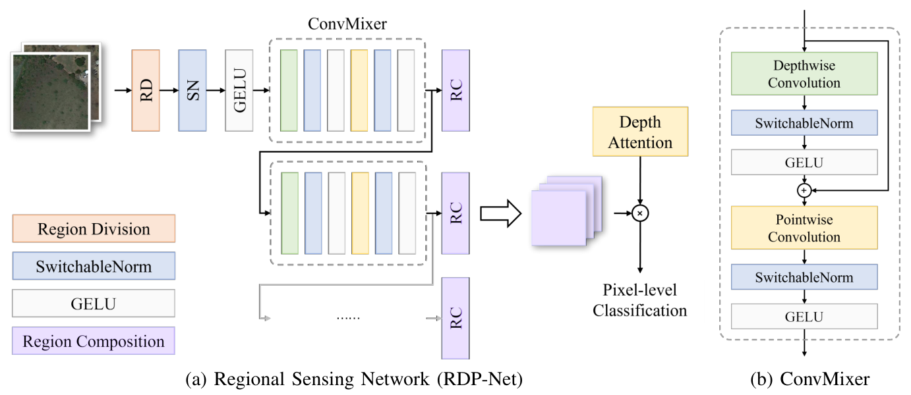

# RDP-Net: Region Detail Preserving Network for Change Detection




The pytorch implementation for RDP-Net.

```python
from RDPNet import RDPNet
net = RDPNet(in_ch=3, out_ch=2).to(device)
```

The pytorch implementation for Edge Loss.

```python
from edgeloss import combine_loss
loss = combine_loss(prediction, target)
```

Well-trained model.

```python
# For CDD dataset
net.load_state_dict(torch.load("RDPNet_CDD.pth"))
```

## Paper

This work has been accepted for publication in the [IEEE Transactions on Geoscience and Remote Sensing (TGRS)](https://ieeexplore.ieee.org/xpl/RecentIssue.jsp?punumber=36).
The paper is now avaliable on [TGRS Early Access](https://ieeexplore.ieee.org/document/9970750) and arXiv [Link](https://arxiv.org/abs/2202.09745).

```bibtex
@article{chen2022rdpnet,
    author={Chen, Hongjia and Pu, Fangling and Yang, Rui and Tang, Rui and Xu, Xin},
    journal={IEEE Transactions on Geoscience and Remote Sensing}, 
    title={RDP-Net: Region Detail Preserving Network for Change Detection}, 
    year={2022},
    volume={},
    number={},
    pages={1-1},
    doi={10.1109/TGRS.2022.3227098},
}
```

## Introduction

Change detection (CD) is an essential earth observation technique. It captures the dynamic information of land objects. With the rise of deep learning, neural networks (NN) have shown great potential in CD. However, current NN models introduce backbone architectures that lose detailed information during learning. Moreover, current NN models are heavy in parameters, which prevents their deployment on edge devices such as UAVs. In this work, we tackle this issue by proposing RDP-Net: a region detail preserving network for CD. We propose an efficient training strategy that constructs the training tasks during the warmup period of NN training and lets the NN learn from easy to hard. The training strategy enables NN to learn more powerful features with fewer FLOPs and achieve better performance. Next, we propose an effective edge loss that increases the penalty for errors on details and improves the network's attention to details such as boundary regions and small areas. Furthermore, we provide a NN model with a brand new backbone that achieves the state-of-the-art empirical performance in CD with only 1.70M parameters. We hope our RDP-Net would benefit the practical CD applications on compact devices and could inspire more people to bring change detection to a new level with the efficient training strategy.

## Dataset

### CDD

Paper: [Change Detection in Remote Sensing Images using Conditional Adversarial Networks](https://pdfs.semanticscholar.org/ae15/e5ccccaaff44ab542003386349ef1d3b7511.pdf)

Link: is not avaliable now, but you can contact the author (MLebedev@gosniias.ru) to get this Dataset.

### LEVIR-CD

Paper: [A Spatial-Temporal Attention-Based Method and a New Dataset for Remote Sensing Image Change Detection](https://www.mdpi.com/2072-4292/12/10/1662)

[Link](https://justchenhao.github.io/LEVIR/)

<!-- ## Citation

If you find this work valuable or use our code in your own research, please consider citing us with the following bibtex:

```
``` -->

## Comparison Methods

* FC-Siam-diff: [Fully Convolutional Siamese
Networks for Change Detection](https://ieeexplore.ieee.org/abstract/document/8451652)
* UNet++_MSOF: [End-to-End Change Detection for High Resolution Satellite Images Using Improved UNet++](https://www.mdpi.com/2072-4292/11/11/1382)
* DASNet: [DASNet: Dual Attentive Fully Convolutional Siamese Networks for Change Detection in High-Resolution Satellite Images](https://ieeexplore.ieee.org/abstract/document/9259045)
* SNUNet-CD: [SNUNet-CD: A Densely Connected Siamese Network for Change Detection of VHR Images](https://ieeexplore.ieee.org/abstract/document/9355573)

## Contact

Hongjia Chen: chj1997@whu.edu.cn